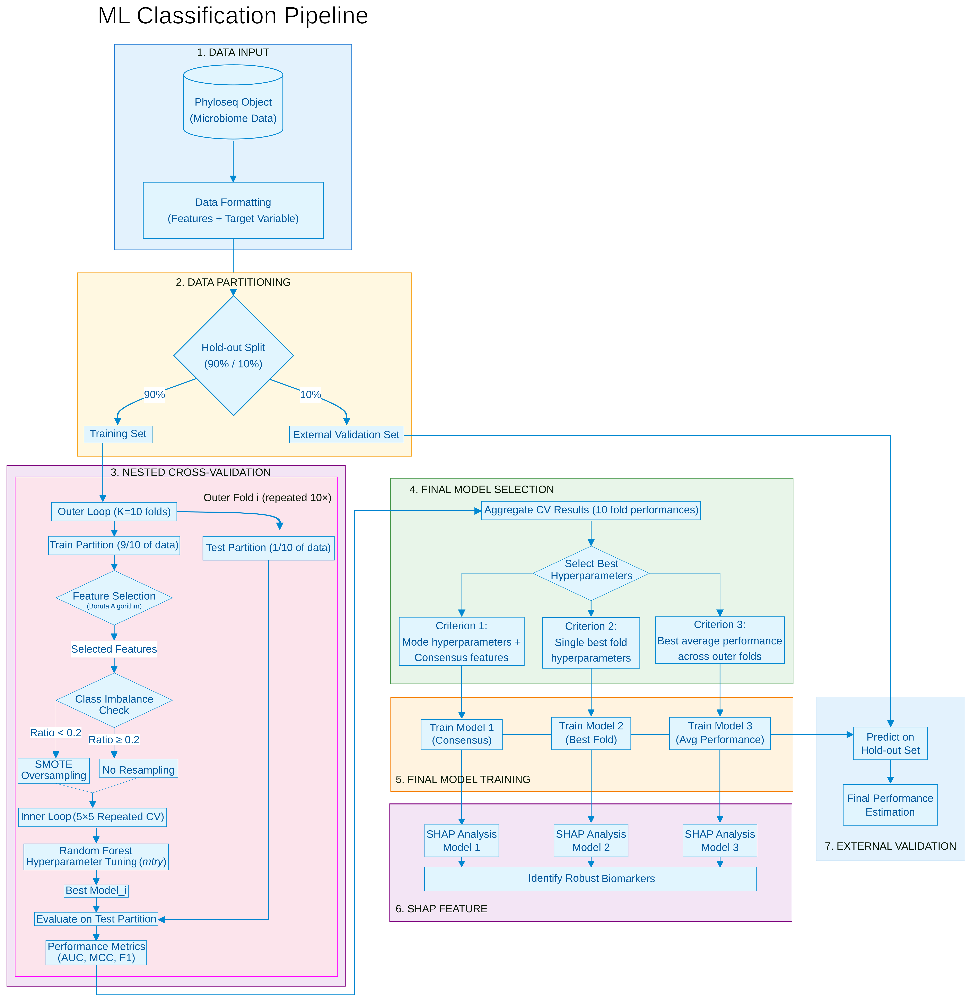

# MLPredictR
Scripts for Implementing different Machine Learning Algorithms in R using the caret Library. The repository is currently under development, and additional algorithms may be included in the future. At present, it features implementations of Random Forest, GLMNet, and XGBoost.

## Pipeline workflow

*Figure 1: Nested cross-validation framework for microbiome classification*

## Requirements

- [caret](https://cran.r-project.org/web/packages/caret/index.html)
- [phyloseq](https://www.bioconductor.org/packages/release/bioc/html/phyloseq.html)
- [doParallel](https://cran.r-project.org/web/packages/doParallel/index.html) 
- [Boruta](https://cran.r-project.org/web/packages/Boruta/index.html) 
- [xgboost](https://cran.r-project.org/web/packages/xgboost/index.html) 
- [pROC](https://cran.r-project.org/web/packages/pROC/index.html) 
- [microbiome](https://www.bioconductor.org/packages/release/bioc/html/microbiome.html) 
- [cvAUC](https://cran.r-project.org/web/packages/cvAUC/index.html) 
- [ggplot2](https://cran.r-project.org/web/packages/ggplot2/index.html) 
- [ggpubr](https://cran.r-project.org/web/packages/ggpubr/index.html) 
- [DMwR](https://cran.r-project.org/src/contrib/Archive/DMwR/) 

## Quick Start

### 1. Clone the repository
```bash
git clone https://github.com/your-username/Liver_Disease_Microbiome_ML.git
cd Liver_Disease_Microbiome_ML
```

### 2. Configure the pipeline
Edit `ml_classification_pipeline.sh` and modify these variables:

```bash
# Path to Functions directory (REQUIRED)
DIR_FUNCTIONS=$HOME"/github_shared_code_and_publications/Liver_Disease_Microbiome_ML/Functions"

# Input data
infile=../Test_data/in_phylo.rds  # Your phyloseq object
Variable="condition"               # Target variable in metadata

# Parameters
PrevCutoff=0.2          # Prevalence filter (20%)
ncores=15               # CPU cores
hold_out_size=0.1       # Hold-out set proportion (10%)
Feature_selection=T     # Boruta feature selection (T/F)
```

### 3. Run the pipeline
```bash
bash ml_classification_pipeline.sh
```

## Pipeline Steps

The pipeline executes three main steps:

| Step | Script | Description |
|------|--------|-------------|
| 1 | `infile_partition.R` | Splits data into training (90%) and hold-out (10%) sets |
| 2 | `RandomForest.R` | Trains RF with nested CV + optional Boruta feature selection |
| 3 | `Best_model.R` | Selects and retrains best model on full training set |
| 4 | `Predict_ML.R` | Validates on hold-out set (optional) |

## Output Files

```
Results/
├── infiles/
│   ├── phylo_training_set.rds
│   └── phylo_holdout_validation_set.rds
├── RandomForest_FS_TRUE/
│   ├── list_CV_models.rds              # All CV fold models
│   ├── stats_model.tsv                 # Per-fold metrics
│   ├── Summary_Statistics_Nested_CV.tsv # Aggregated CV stats
│   ├── BEST_MODEL_NestCV.rds           # Best model from CV
│   ├── BEST_MODEL_outerloop_performance.rds
│   ├── Metrics_CV_Boxplots.pdf         # Performance plots
│   └── data_balance_report.txt         # Class balance info
└── *.tsv                               # Validation results
```

## Input Data Format

The input must be a **phyloseq object** (.rds) containing:
- `otu_table`: Feature abundance matrix
- `sample_data`: Metadata with the target variable
- `tax_table`: (optional) Taxonomy information

## Classification Examples

### Random Forest with Feature Selection
```bash
ML_method=$HOME"/github_projects/mlpredictr/Scripts/RandomForest.R"
Feature_selection=T

Rscript --vanilla $ML_method $infile $Variable $PrevCutoff $Feature_selection $ncores $DIR_FUNCTIONS
```

### XGBoost
```bash
ML_method=$HOME"/github_projects/mlpredictr/Scripts/XGboost.R"
Feature_selection=F
GridMatrix="xgbGrid_small"  # Options: xgbGrid_small, xgbGrid_mid, xgbGrid_large

Rscript --vanilla $ML_method $infile $Variable $PrevCutoff $Feature_selection $ncores $GridMatrix $DIR_FUNCTIONS
```

### GLMNet
```bash
ML_method=$HOME"/github_projects/mlpredictr/Scripts/glmnet.R"
Feature_selection=T

Rscript --vanilla $ML_method $infile $Variable $PrevCutoff $Feature_selection $ncores $DIR_FUNCTIONS
```

## Regression

For continuous variables, the best model minimizes RMSE:

```bash
Variable="moisture"  # Continuous variable

# Use same scripts - they auto-detect regression vs classification
Rscript --vanilla $ML_method $infile $Variable $PrevCutoff $Feature_selection $ncores $DIR_FUNCTIONS

# Plot results
Rscript --vanilla $Plot_RMSE_importance $infile $Variable $PrevCutoff $Dir_Results $DIR_FUNCTIONS
```

## Performance Metrics

**Classification:**
- AUC, Accuracy, Kappa, MCC, F1-score
- Sensitivity, Specificity, Precision
- PPV, NPV

**Regression:**
- RMSE, R², MAE

## Citation

If you use this pipeline, please cite:
```
[Add citation here]
```

## License

[Add license]

## Contact

Jorge Francisco Vázquez Castellanos
