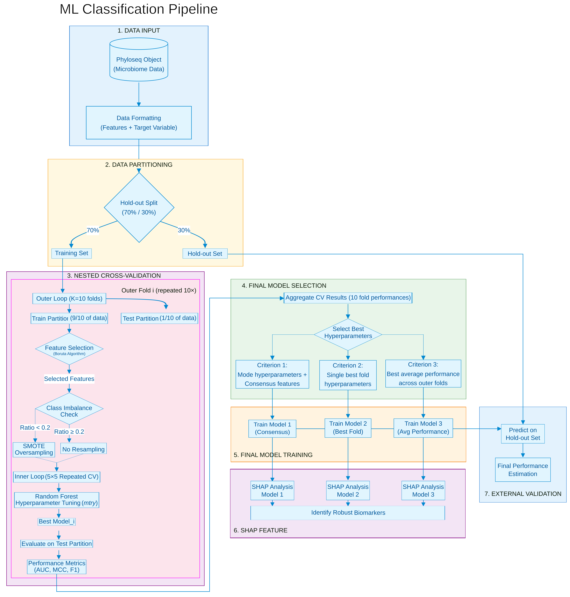

# Liver_Disease_Microbiome_ML
Scripts for implementing Random Forest classification in R using the caret library with nested cross-validation, Boruta feature selection, and SHAP-based feature importance.

## Pipeline workflow

*Figure 1: Nested cross-validation framework for microbiome classification*

## Requirements

- [caret](https://cran.r-project.org/web/packages/caret/index.html)
- [coin](https://cran.r-project.org/web/packages/coin/index.html/) 
- [phyloseq](https://www.bioconductor.org/packages/release/bioc/html/phyloseq.html)
- [doParallel](https://cran.r-project.org/web/packages/doParallel/index.html) 
- [Boruta](https://cran.r-project.org/web/packages/Boruta/index.html) 
- [pROC](https://cran.r-project.org/web/packages/pROC/index.html) 
- [microbiome](https://www.bioconductor.org/packages/release/bioc/html/microbiome.html) 
- [cvAUC](https://cran.r-project.org/web/packages/cvAUC/index.html) 
- [ggplot2](https://cran.r-project.org/web/packages/ggplot2/index.html) 
- [ggpubr](https://cran.r-project.org/web/packages/ggpubr/index.html) 
- [DMwR](https://cran.r-project.org/src/contrib/Archive/DMwR/) 
- [fastshap](https://cran.r-project.org/web/packages/fastshap/index.html/) 
- [rstatix](https://cran.r-project.org/web/packages/rstatix/index.html/) 
- [shapviz](https://cran.r-project.org/web/packages/shapviz/index.html/) 

## Quick Start

### 1. Clone the repository
```bash
git clone https://github.com/jorgevazcast/Liver_Disease_Microbiome_ML.git
cd Liver_Disease_Microbiome_ML
```

### 2. Configure the pipeline

Edit `ml_classification_pipeline.sh` and modify these parameters:
```bash
# Input data
infile="$HOMEC/Test_data/in_phylo.rds"  # Your phyloseq object

# Model parameters
Variable="condition"          # Target variable (column in metadata)
PrevCutoff=0.2                # Prevalence filter (20%)
ncores=15                     # CPU cores for model training
hold_out_size=0.3             # Hold-out set proportion (30%)
Feature_selection=TRUE        # Boruta feature selection (TRUE/FALSE)
```

### 3. Run — Standard cross-validation
```bash
bash ml_classification_pipeline.sh
```

### 4. Run — Leave-One-Cohort-Out cross-validation (LOCO-CV)
```bash
bash ml_classification_pipeline_LOCO_CV.sh
```
> Use LOCO-CV when your dataset spans multiple cohorts and you want to assess
> whether the model generalises across cohort-specific batch effects.


## Pipeline Steps

| Step | Script | Description |
|------|--------|-------------|
| 1 | `infile_partition.R` | Splits data into training and hold-out sets |
| 2 | `RandomForest.R` | Trains RF with nested CV + optional Boruta feature selection |
| 3 | `Best_model.R` | Selects and retrains best model on full training set |
| 4 | `Predict_ML.R` | Validates models on hold-out set |
| 5 | `SHAP_biomarker_importance.R` | Computes SHAP values for feature importance |

## Output Structure
```
Results/
├── infiles/                                  # Partitioned data (from infile_partition.R)
│   ├── phylo_training_set.rds               # Training set (70% of data)
│   └── phylo_holdout_validation_set.rds     # Hold-out validation set (30% of data)
│
├── RandomForest_FS_TRUE/                    # Model outputs (FS_TRUE = Boruta feature selection enabled)
│   │
│   │ # ─── Cross-validation models ───
│   ├── list_CV_models.rds                   # List of all 10 trained models from outer CV folds
│   ├── outer_loop_cv_sample_index.rds       # Sample indices for each outer fold (reproducibility)
│   │
│   │ # ─── Best models (for prediction) ───
│   ├── BEST_MODEL_NestCV.rds                # Best hyperparameters from nested CV, retrained on full data
│   ├── BEST_MODEL_NestCV_common_features.rds # Same as above, using only features selected in ALL folds
│   ├── BEST_MODEL_outerloop_performance.rds # Model from fold with best outer loop performance
│   │
│   │ # ─── Performance metrics ───
│   ├── stats_model.tsv                      # Per-fold metrics (AUC, MCC, Accuracy, etc.)
│   ├── stats_pooled_model.tsv               # Pooled predictions across all outer folds
│   ├── Summary_Statistics_Nested_CV.tsv     # Mean ± SD of metrics across folds
│   ├── Stats_CV_models_outer_loops.rds      # Detailed stats for model selection
│   │
│   │ # ─── Predictions ───
│   ├── pooled_outer_loop_cv_predictions.rds # All test predictions from outer CV
│   │
│   │ # ─── Plots ───
│   ├── Metrics_CV_Boxplots.pdf              # Boxplots of performance metrics across folds
│   ├── pooled_outer_loop_roc_curve.pdf      # ROC curve plot (pooled predictions)
│   ├── AUC_plot.pdf                         # AUC visualization per fold
│   ├── Importance_plot.pdf                  # Feature importance barplot
│   │
│   │ # ─── Data reports ───
│   ├── data_balance_report.txt              # Class distribution and imbalance assessment
│   └── Different_models.txt                 # Performance differences between model strategies
│
├── BEST_MODEL_*_stats/                      # Validation results on hold-out set (from Predict_ML.R)
│   ├── confusion_matrix.tsv                 
│   ├── performance_metrics.tsv              
│   └── predictions.rds                      
│
└── SHAP_*/                                  # SHAP analysis (from SHAP_biomarker_importance.R)
    ├── SHAP_object.rds                      
    └── SHAP_Imp.pdf                         
```

### Best Models for Prediction

| Model | Description | Use case |
|-------|-------------|----------|
| `BEST_MODEL_outerloop_performance.rds` | Model from CV fold with highest AUC/MCC | Best empirical performance |
| `BEST_MODEL_NestCV.rds` | Best hyperparameters from nested CV, retrained on all training data | Recommended for new predictions |
| `BEST_MODEL_NestCV_common_features.rds` | Same as above, but uses only features selected in ALL CV folds | Most robust/generalizable |

### How to Use Best Models
```r
# Load a best model
model <- readRDS("RandomForest_FS_TRUE/BEST_MODEL_outerloop_performance.rds")

# Predict on new data
predictions <- predict(model, newdata = new_data)
```


### Key Output Files Explained

| File | Description |
|------|-------------|
| `list_CV_models.rds` | Contains all 10 Random Forest models trained during nested CV outer loop |
| `stats_model.tsv` | Performance metrics (AUC, MCC, Accuracy, Kappa, F1, Sensitivity, Specificity) for each CV fold |
| `Summary_Statistics_Nested_CV.tsv` | Aggregated statistics: mean, SD, median, IQR across all folds |
| `pooled_outer_loop_cv_predictions.rds` | Combined test set predictions from all outer folds for unbiased evaluation |
| `data_balance_report.txt` | Reports if classes are imbalanced (>1:5 ratio triggers SMOTE) |
| `importance_df.rds` | Feature importance from each fold, used for consensus importance plots |

## Input Data Format

The input must be a **phyloseq object** (.rds) containing:

- `otu_table`: Feature abundance matrix
- `sample_data`: Metadata with the target variable
- `tax_table`: (optional) Taxonomy information

## Performance Metrics

- AUC, Accuracy, Kappa, MCC, F1-score
- Sensitivity, Specificity, Precision
- PPV, NPV

## Citation

If you use this pipeline, please cite:
```
[Add citation here]
```

## License

MIT License - Copyright (c) 2025 Jorge Francisco Vázquez Castellanos

See [LICENSE](LICENSE) for details.

## Contact

Jorge Francisco Vázquez Castellanos
